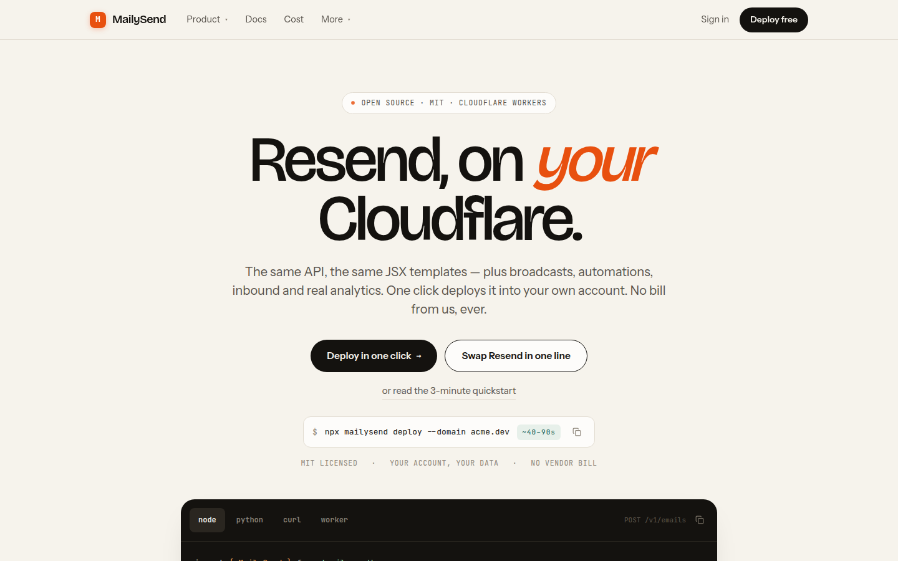
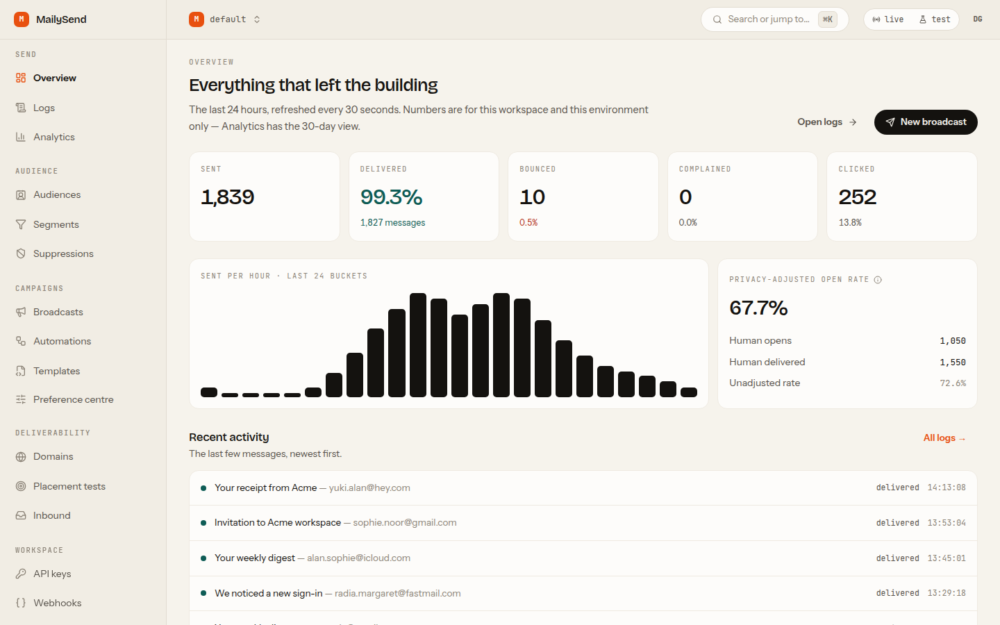
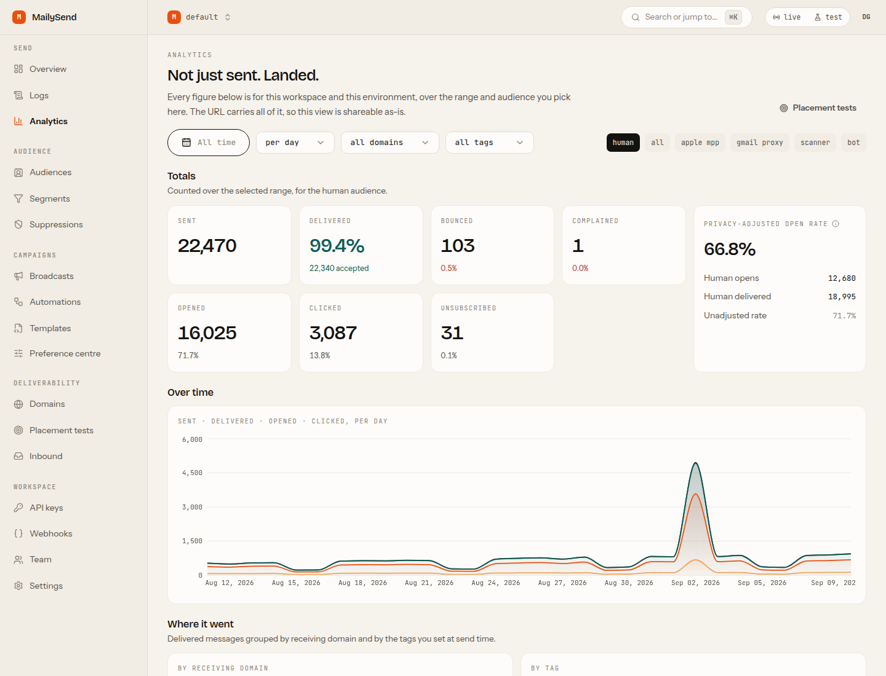
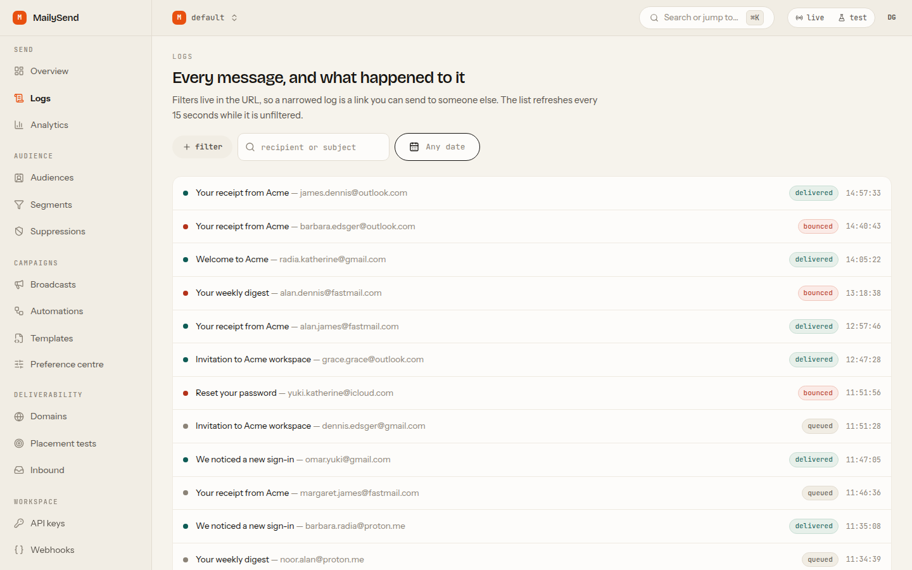
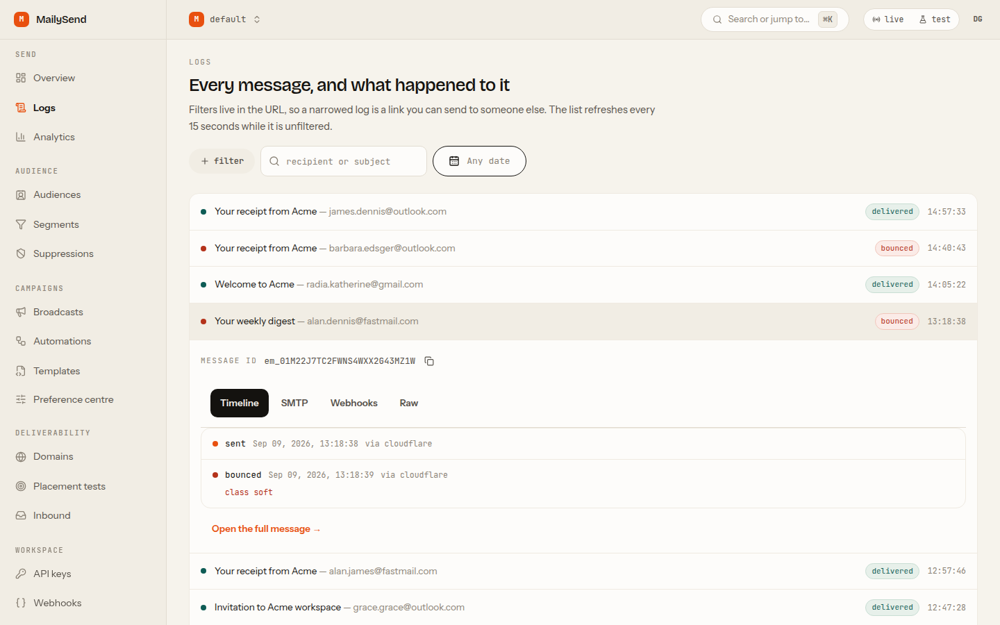
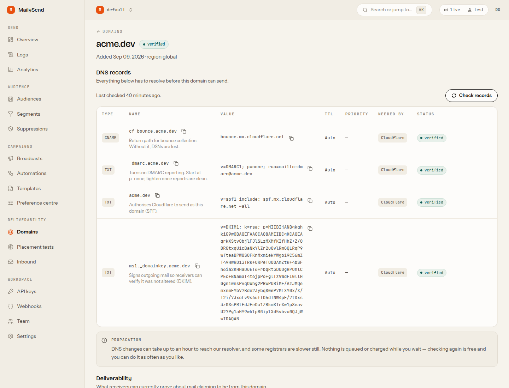
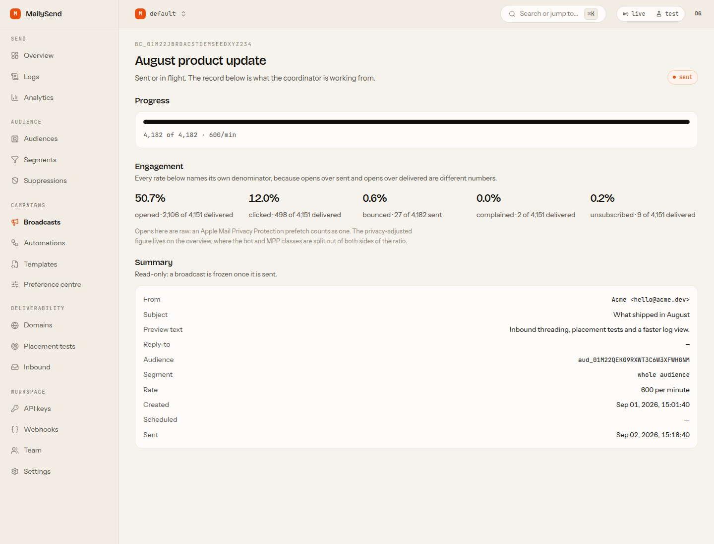
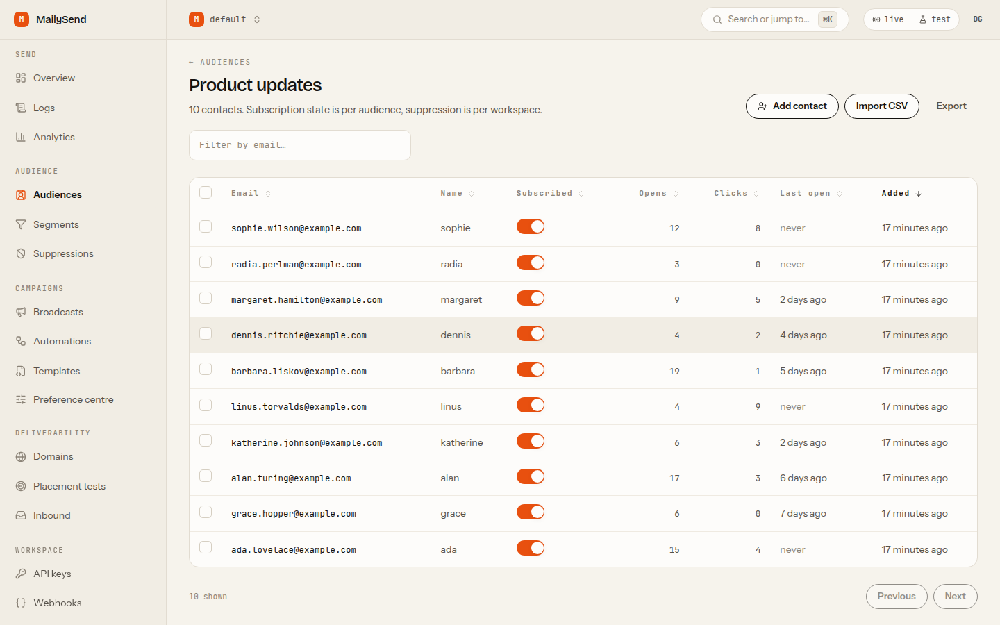
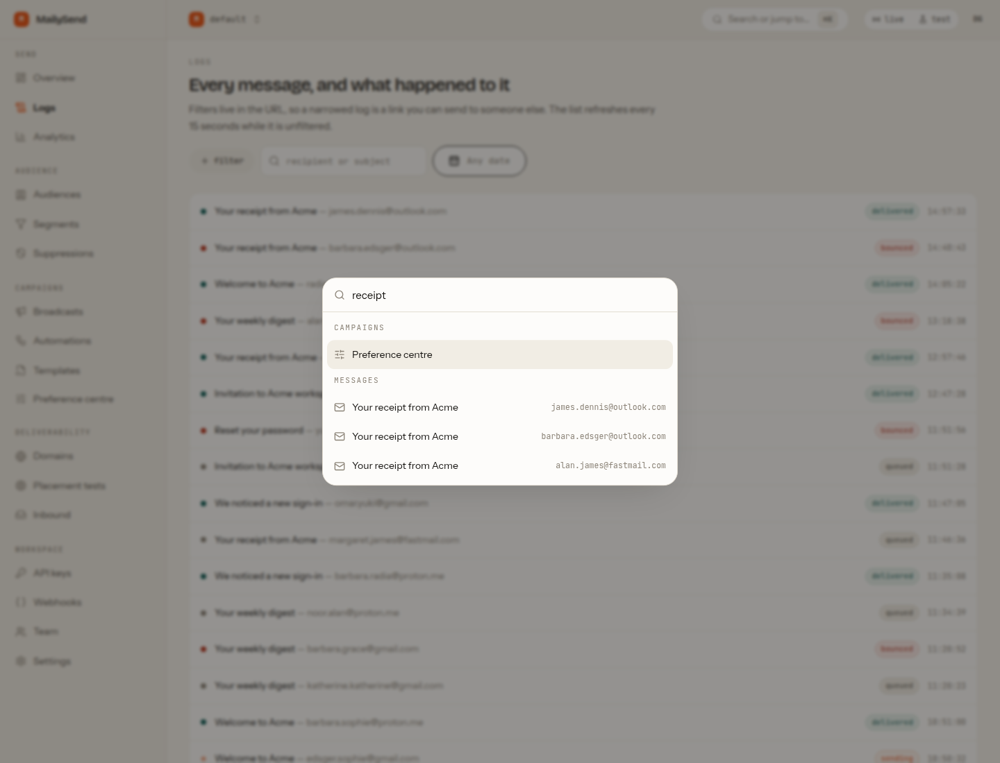
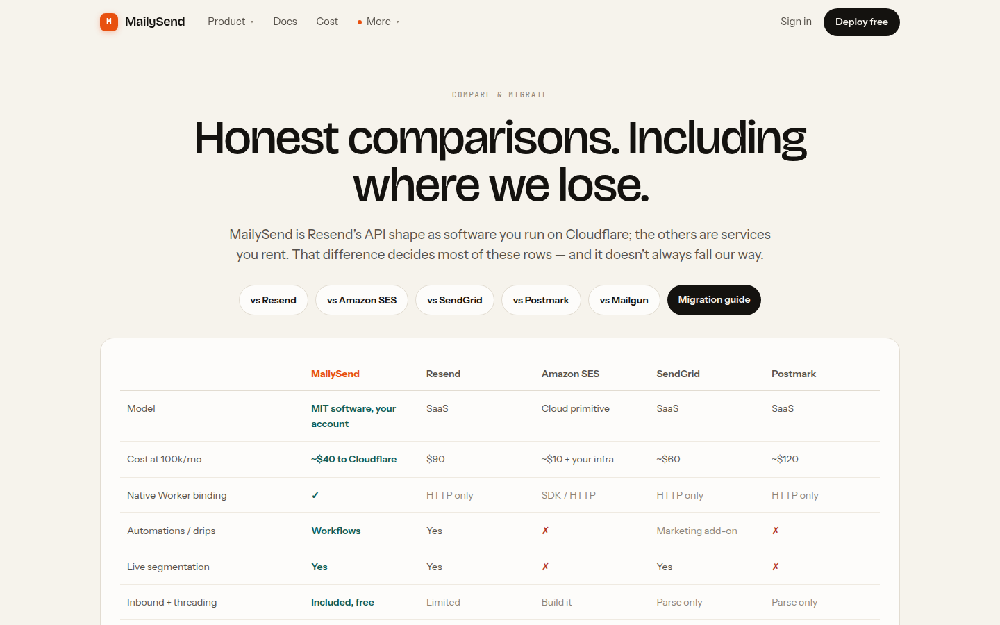

<div align="center">



# MailySend

### **Resend, on _your_ Cloudflare.**

The complete email platform — transactional sending, marketing broadcasts, automations,
inbound mail with threading and deliverability analytics — running entirely on Cloudflare
Workers, **in your own account**. Drop-in compatible with the Resend API. MIT licensed.
Also runs on a plain Node server with no Cloudflare account at all.

[**Live demo → mailysend.com**](https://mailysend.com) &nbsp;·&nbsp;
[Docs](https://mailysend.com/docs) &nbsp;·&nbsp;
[Dashboard tour](https://mailysend.com/dashboard-tour) &nbsp;·&nbsp;
[Honest comparisons](https://mailysend.com/compare) &nbsp;·&nbsp;
[Cost](https://mailysend.com/pricing)

[](LICENSE)
[](https://workers.cloudflare.com/)
[](https://nodejs.org/)

[](https://deploy.workers.cloudflare.com/?url=https://github.com/GagnDeep/mailysend)

</div>

---

## Why this exists

You like Resend's API. You do not like that your sending history, your contact list and
your bounce data live in someone else's account, on their retention policy, at a per-email
markup over what the bytes actually cost.

MailySend is that API — reimplemented on Cloudflare's own primitives — plus everything a
platform can do only when it runs where your data already is.

```diff
  import { Resend } from 'resend'
- const resend = new Resend(process.env.RESEND_API_KEY)
+ const resend = new Resend(process.env.MAILYSEND_API_KEY)
+ // RESEND_BASE_URL=https://your-deployment/v1
```

The `resend` npm package honours `RESEND_BASE_URL`, so that really is the whole migration —
no code changes, no rewrite, no lock-in either direction. There is also a first-party
`mailysend` SDK, and `mailysend/compat` exports a `Resend` class with the same method names
if you would rather be explicit.

---

## What you get

| | |
|---|---|
| 📤 **Transactional sending** | `POST /v1/emails`, batches of 100, scheduling 30 days out, idempotency keys, attachments, tags, typed errors |
| 🔀 **Four transports, one API** | Cloudflare Email Service (default), Amazon SES v2, Resend, generic SMTP — deterministic routing, automatic failover, no vendor lock-in |
| 📣 **Marketing** | Audiences, contacts, custom properties, CSV import, live segments, broadcasts with A/B testing and holdouts, a preference centre |
| 🔁 **Automations** | Visual step builder on Cloudflare Workflows — send, wait, branch, tag, webhook — in per-contact or cohort mode |
| 📥 **Inbound** | Real mailboxes, MIME parsing, reply threading, full-text search, attachments streamed straight to R2 |
| 📊 **Deliverability** | Delivery events, bounce classification, parsed DMARC aggregate reports, seed-list inbox placement with its source labelled |
| 👁️ **Analytics** | Opens and clicks with bot / MPP classification, per-domain and per-tag breakdowns, daily rollups, long-term NDJSON archive in R2 |
| 🤖 **Agents** | A nine-tool MCP server so an assistant can read and draft mail — with a confirmation you approve at `/app/approvals` before anything sends |
| 🎨 **Templates** | Handlebars, MJML, a restricted JSX AST compiler, versioning with diff and rollback |
| 🔗 **Webhooks** | HMAC-signed, retried on a queue then a durable tail, every attempt's response stored, replayable |
| 🔐 **Auth** | Passkeys and single-use recovery codes for the dashboard, Cloudflare Access when you have it, a CLI device flow, hashed API keys for the API, RBAC, invites, audit log — and no password store anywhere |
| 🚀 **SEO built in** | 42 prerendered pages (marketing, docs and 26 guides), JSON-LD, OG images, `sitemap.xml`, `robots.txt`, `llms.txt` |

---

## How it compares

### MailySend vs. the hosted services

This is the same matrix the site publishes at [/compare](https://mailysend.com/compare),
including the last row.

| | **MailySend** | Resend | Amazon SES | SendGrid | Postmark |
|---|:--|:--|:--|:--|:--|
| Model | **MIT software, your account** | SaaS | Cloud primitive | SaaS | SaaS |
| Cost at 100k/mo | **~$40 to Cloudflare** | $90 | ~$10 + your infra | ~$60 | ~$120 |
| Native Worker binding | **✅** | HTTP only | SDK / HTTP | HTTP only | HTTP only |
| Automations / drips | **Workflows** | Yes | ❌ | Marketing add-on | ❌ |
| Live segmentation | **Yes** | Yes | ❌ | Yes | ❌ |
| Inbound + threading | **Included, free** | Limited | Build it | Parse only | Parse only |
| Inbox-placement analytics | **Per provider** | Delivery only | CloudWatch | Partial | Strong |
| Parsed DMARC aggregate reports | **✅** | ❌ | ❌ | ❌ | ❌ |
| Multi-provider sending + failover | **✅** | ❌ | ❌ | ❌ | ❌ |
| MCP server for agents | **✅** | ❌ | ❌ | ❌ | ❌ |
| Data location | **Your account** | Theirs | Your AWS | Theirs | Theirs |
| **Who is on call** | **You** | Them | AWS | Them | Them |

Resend has grown into a genuinely capable marketing product, and this table says so — the
rows the artboards originally marked "No" now read the way a prospect would actually find
them. The thing Resend still cannot be is **yours**. And Postmark measures placement better
than we do; that row says so too.

### What it costs to send 100,000 emails a month

| | Monthly | Basis |
|---|---|---|
| **MailySend + SES** | **$16.20** | $5 Workers Paid + $0.10/1k + ~$1.20 storage/queues/analytics — one config line |
| **MailySend + Cloudflare** | **$40.15** | $5 Workers Paid + $0.35/1k after the 3,000 included + ~$1.20 — no second account |
| Resend | $90 | published plan ladder (Pro 100k) |
| SendGrid | $60 | ≈$0.60 per 1,000 |

Same product either way: same API, same dashboard, same logs, same analytics, same inbound.
The transport is one line of configuration and you can change it later, so the row to read
is whichever backend you already have an account with.

Amazon SES on its own is about **$10** at this volume, and it is worth being clear about what
that buys: an SMTP wire. No dashboard, no event timeline, no segments, no broadcasts, no
inbound, and CloudWatch where the analytics would be. MailySend runs *on top of* SES for the
same $0.10 per thousand — that is the first row of this table, not a competitor to it.

Estimates for planning, not a quote — and the same formulas the site's own calculator runs,
so you can move the slider at [mailysend.com/pricing](https://mailysend.com/pricing) and check
them. The dashboard also shows your real month-to-date Cloudflare spend next to your send
volume, so the estimate is answerable to a number.

---

## See it running

Everything below is the live deployment at **[mailysend.com](https://mailysend.com)** — one Node
process behind nginx, or one Worker, from this exact repository. Real traffic, not empty states.

**The overview, on a month of sending**

Sent, delivered, bounced, complained and the hourly curve — with the counts of record coming from
SQL rollups, never from a sampled analytics store.



**Analytics that names its own denominators**

A 30-day series, delivery grouped by receiving domain and by the tags you set at send time, opens
and clicks split by who actually generated them, and inbox placement per provider with the source
of every figure attached.



<table>
<tr>
<td width="50%" valign="top">

**Every message, and what happened to it**

The full log with filters that live in the URL, and a drawer per message: state timeline, the SMTP
conversation, every webhook attempt and its response, and the raw MIME.



</td>
<td width="50%" valign="top">

**One message, all the way down**



</td>
</tr>
<tr>
<td width="50%" valign="top">

**Domain setup that finishes**

Every DNS record for the active transport, copy-buttoned, with SPF/DKIM/DMARC state and the
deliverability posture on one page.



</td>
<td width="50%" valign="top">

**Broadcasts with a real denominator**

Progress from the coordinator's own counters, and every engagement rate stated over the
denominator it was actually computed from.



</td>
</tr>
<tr>
<td width="50%" valign="top">

**Audiences and live segments**

Contacts, custom properties, CSV import, and segments written in a real query DSL that compiles to
parameterised SQL.



</td>
<td width="50%" valign="top">

**⌘K to anywhere**

Jump to any message, domain, template or doc page. `G L` for logs, `G B` for broadcasts. No screen
in the product ends in "contact support".



</td>
</tr>
</table>

<div align="center">

<br><em>The comparison page ships the rows where we lose, too. <a href="https://mailysend.com/compare">See it live →</a></em>
</div>

---

## Get running

### Path 1 — Cloudflare Workers (one click)

[](https://deploy.workers.cloudflare.com/?url=https://github.com/GagnDeep/mailysend)

The button forks the repo, connects it to Workers Builds, then builds and deploys. The
build creates the account resources the Worker binds — see below; the button itself
provisions less than its documentation implies.

**The deploy form has no fields on it.** There is nothing you need to know before the
first boot: on its first request the instance applies its own migrations, creates the
workspace, generates and stores a 32-byte signing secret, learns its own public URL from
the request it is answering, and prints one bootstrap API key to the log.

That form is built from the repo's `.env.example`, and it is worth knowing exactly what
Cloudflare does with it: it shows key names only — never the comments — it stores every
answer as a secret, and it does **not** prefill from the values in the file. So a key with
a perfectly good default renders as a blank, masked, mandatory-looking password box,
indistinguishable from a credential the deployment cannot start without. That is why the
file carries no keys at all. Every variable — `MS_MODE`, `MS_LANDING`,
`MS_DEFAULT_PROVIDER`, `EVENT_DETAIL`, `MS_OWNER_EMAIL` and the `MS_OIDC_*` group — is
listed with its default in [docs/CONFIGURATION.md](docs/CONFIGURATION.md) and set
afterwards with `wrangler secret put` or a `vars` entry.

When it finishes, open the deployment's URL. It lands on **`/setup`**, where you claim the
instance with a passkey — no email, no DNS and no identity provider needed, because a
freshly deployed Worker has none of those.

The first person to reach `/setup` takes the deployment, so claim it now rather than
later. Setting `MS_OWNER_EMAIL` narrows the claim to one address — it does not create an
owner, it restricts who may become one. For a URL that is public before you get to it,
`MS_REQUIRE_CLAIM_CODE=1` makes first boot print a **claim code** to the deploy log
(`wrangler tail`, or the Worker's *Logs* tab) that `/setup` then demands, so whoever finds
the deployment first cannot claim it without reading its log. Everything else can wait
until you are inside.

**The build creates what the button does not.** `wrangler deploy` validates every binding
before it uploads, so a missing queue or namespace is a failed deploy rather than a
degraded Worker — a clean account used to fail one resource at a time. `build:cf` therefore
ends by running `scripts/ensure-resources.mjs`, which creates the twelve queues, the R2
bucket, the D1 database and the two KV namespaces, then writes the generated D1 and KV ids
into the config wrangler deploys. It matches by name and creates only what is missing, so
every build after the first is a no-op — which matters, because re-creating `SUPPRESSIONS`
rather than reusing it would silently empty it. It acts only inside Workers Builds
(`WORKERS_CI=1`) or under `MS_ENSURE_RESOURCES=1`, so building locally never touches your
account. Analytics Engine datasets need nothing; they are created on first write.

To do it yourself instead, from your own machine:

```bash
export CLOUDFLARE_ACCOUNT_ID=... CLOUDFLARE_API_TOKEN=...
npx mailysend provision
```

That token needs `Queues:Edit`, plus `Workers Scripts:Edit`, `D1:Edit`, `Workers KV:Edit`
and `Workers R2:Edit` if you also deploy with it rather than from the button.
`.github/workflows/deploy.yml` runs both steps on `workflow_dispatch` if you would rather
it happened in CI.

**The commands Cloudflare guesses now work.** They did not always: it proposes `pnpm deploy`,
which never runs the script of that name because `deploy` is one of pnpm's own subcommands
and the built-in always wins, and then a bare `npx wrangler deploy` from the repo root,
where wrangler cannot tell which workspace package is the Worker. So no script here is
called `deploy` any more, and `build:cf` ends by writing a root `wrangler.json` — a copy of
the config Vite generates next to the bundle, with its paths rewritten, regenerated on
every build and gitignored.

To set them explicitly instead, under **Workers → your Worker → Settings → Builds**:

| | |
|---|---|
| Build command | `pnpm run build:cf` |
| Deploy command | `npx wrangler deploy -c apps/app/.output-cf/server/wrangler.json` |

The `-c` matters: the Worker is built by Vite, and the wrangler config it deploys from is
the one Vite generates next to the bundle, not the `apps/app/wrangler.jsonc` you edit.

### Path 2 — a Node server (no Cloudflare account)

`node:sqlite` backs the database, the filesystem backs blobs, and in-process actors back
the Durable Objects. Same code, different driver.

```bash
pnpm install
pnpm build:node
PORT=8917 node apps/app/node-server.mjs
```

That is the whole command — there is no required environment variable on this path
either. First boot migrates the database, creates the workspace, generates and stores the
signing secret, and prints one API key. The key is printed exactly once, because only its
SHA-256 hash is ever stored. Then open `http://localhost:8917/`, which sends you to
`/setup` to claim the instance with a passkey.

The first person to reach `/setup` claims it. Set `MS_OWNER_EMAIL=you@your-domain.com` to
narrow the claim to a single address, `MS_REQUIRE_CLAIM_CODE=1` to have first boot print a
**claim code** that `/setup` then asks for — the log is the one place it exists, and
reading the log is the proof — and `MS_SECRET` to a 32-byte hex string if you would rather keep the signing key out of the
database and be able to rotate it. All optional. The full list is in
[docs/CONFIGURATION.md](docs/CONFIGURATION.md).

The guides, once it is up:

| | |
|---|---|
| [docs/SENDING.md](docs/SENDING.md) | Choosing a transport, and a real walkthrough for each of the four |
| [docs/RECEIVING.md](docs/RECEIVING.md) | Email Routing, the catch-all toggle, mailboxes, the MX preflight, and what `matched_by` means |
| [docs/MAIL.md](docs/MAIL.md) | The inbox, test mode, and the keyboard |
| [docs/AUTH.md](docs/AUTH.md) | Every door in, OIDC included |
| [docs/MCP.md](docs/MCP.md) | The nine agent tools, the confirmation protocol, and how a key scopes an agent |
| [docs/AGENTS.md](docs/AGENTS.md) | The agent skill, and what to give an agent first |
| [docs/WEBHOOKS.md](docs/WEBHOOKS.md) | Signature, tolerance, the retry ladder, auto-disable |
| [docs/CONFIGURATION.md](docs/CONFIGURATION.md) | Environment variables and bindings |

<details>
<summary><b>Production: PM2 + nginx</b> (this is how the live demo runs)</summary>

```bash
pnpm build:node
pm2 start ecosystem.config.cjs
pm2 save && pm2 startup
```

`ecosystem.config.cjs` runs **one** `fork`-mode process on purpose. On Node the Durable
Objects are in-process actors, and an actor's entire job is to be a single serialisation
point per key — two processes would each hold their own broadcast cursors and their own
copy of the daily-quota governor, and the governor would then grant twice what it should.

```nginx
map $http_x_forwarded_proto $ms_forwarded_proto {
    ""      $scheme;
    default $http_x_forwarded_proto;
}

server {
    listen 80;
    server_name your-domain.com;
    client_max_body_size 200M;

    location / {
        proxy_pass http://localhost:8917;
        proxy_http_version 1.1;
        proxy_set_header Upgrade $http_upgrade;
        proxy_set_header Connection 'upgrade';
        proxy_set_header Host $host;
        proxy_set_header X-Forwarded-Host $host;
        proxy_set_header X-Forwarded-Proto $ms_forwarded_proto;
        proxy_set_header X-Forwarded-For $proxy_add_x_forwarded_for;
        proxy_cache_bypass $http_upgrade;
    }
}
```

`X-Forwarded-Proto` is load-bearing: without it every absolute URL the app mints —
tracking pixels, unsubscribe links, canonical tags — comes out `http://` on an `https`
site.

</details>

### Then send something

```bash
curl https://your-deployment/v1/emails \
  -H "Authorization: Bearer ms_live_..." \
  -H "Content-Type: application/json" \
  -d '{
    "from": "you@your-domain.com",
    "to": ["someone@example.com"],
    "subject": "Hello",
    "html": "<p>It works.</p>"
  }'
```

The `id` comes back **before any provider is contacted**. That is deliberate: the id is
ours, minted at accept time, so it survives a failover, a provider migration, and a
provider that loses its own id. `provider_message_id` is recorded later and is queryable,
but it is never the identity of a message.

### And then receive something

Sending and receiving are two independent setups on the same domain, and the second one is
configured in two different places — which is the whole reason the first test message
usually bounces.

1. **Cloudflare dashboard → Email → Email Routing.** Enable it (Cloudflare publishes the MX
   records itself), then add a **catch-all** rule whose action is **Send to a Worker**,
   pointed at this instance's script. That is what delivers the domain's mail to MailySend.
2. **In MailySend, under the domain's Receiving tab**, create a mailbox — and turn on
   **Catch-all** on it if you want every address on the domain to land there rather than
   only the one you named.

Step 1 alone is not enough. Mail for an address with no mailbox and no catch-all is refused
at the door with a legible `550 5.1.1 No such mailbox`, which is the honest answer to a
typo and tells a spammer nothing — but it is also exactly what "I bound the catch-all and
nothing arrived" looks like. **Check receiving** on the domain resolves its MX and says
which of the two halves is missing, and both outcomes are written to the event timeline
rather than only to `wrangler tail`.

### Getting into the dashboard

The API takes a key; the dashboard takes a session. A brand-new deployment has no verified
sending domain, no identity provider and nobody to email, so the first session cannot come
from any of those. It comes from **claiming the instance**.

**1 — Claim it at `/setup`.** The first person to open it registers a passkey and becomes
the owner. The claim is a single conditional insert, so two people opening `/setup` at the
same moment produce exactly one owner — the other is told the instance is already claimed.
Then it offers, both skippable, adding a sending domain and minting your first API key
with a live test send.

**2 — Save the recovery codes.** Ten of them, shown once, single-use. They are the way back
in if the passkey is gone, and the reason removing your last passkey is allowed at all.

**3 — Sign in afterwards with the passkey alone.** No email typed: the credential is
discoverable, so the browser offers it and `/sign-in` trades the assertion for a session.

Three other doors exist, and the sign-in page renders each one **only when it is actually
open** — an offered door that answers 501 is worse than no door:

| Door | When it appears | What it needs |
|---|---|---|
| **Recovery code** | always | one of the ten codes |
| **Cloudflare Access** | `MS_ACCESS_TEAM` and `MS_ACCESS_AUD` are set | the assertion is verified against your team's published keys — signature, `iss`, `aud`, `exp` — never merely decoded |
| **Emailed one-time code** | a sending domain is verified | it is sent through this deployment's own send path, from the domain you marked default |

Until a domain is verified, `POST /v1/auth/otp` answers `202 {"status":"unavailable"}` and
the page says so, instead of pointing you at an inbox that will never receive anything.

**Locked out?** `npx mailysend claim --url https://your-instance` is the break-glass path,
and it keeps working after the instance is claimed. It proves control of the deployment
rather than of an inbox: it writes a one-time nonce into the instance's own database —
through the Cloudflare D1 API when `CLOUDFLARE_ACCOUNT_ID` and `CLOUDFLARE_API_TOKEN` are
in your environment, otherwise by printing the exact `wrangler d1 execute` command for you
to run — and then proves it knows that nonce. Only somebody who can write that database
can produce it. You get a session and a fresh API key.

**On the CLI**, `npx mailysend login` uses a device code: it prints an eight-character code
and a URL, you approve it at **Settings → Access** in a browser that is already signed
in, and the CLI receives a full-access key named after the client — revocable from the same
screen as any other key.

**Moving to your own domain** is done from **Settings → Access**. This matters more
than it looks: a passkey is bound to a hostname, so changing the host invalidates every
passkey registered on the old one. The instance stores the hostname each credential was
registered for, shows you which are still usable, and tells you plainly that you need a
recovery code and a re-registration on the new host. `mailysend claim` remains the
guaranteed way in, which is what makes offering the move as a button safe at all.

There is no password store. A self-hosted email platform that invents one is adding the
single credential most likely to be reused and leaked.

<details>
<summary><b>Upgrading a deployment that predates the claim flow</b></summary>

Pull and redeploy; the new migration runs itself on the first request. Nothing else is
required, and nothing you already have is invalidated — existing API keys, sessions,
domains and messages are untouched.

What changes:

- **An instance with an owner already stays claimed.** The first boot after the upgrade
  marks any deployment that already has a member as claimed, so `/setup` will not offer
  your instance to a passer-by. If yours somehow has no member — the common case for a
  deploy nobody ever managed to sign into — it is unclaimed, and `/setup` is how you
  finally get in.
- **`/` now redirects** to `/app` (or `/setup`) on a self-hosted instance. If your
  deployment is meant to serve the public marketing site at its root, set
  `MS_LANDING=marketing`.
- **`/sign-up` is gone**, replaced by `/setup`. The old path redirects.
- **Add a passkey** from Settings once you are in, and generate recovery codes. Until you
  do, your only doors are the ones you already had.
- **Pin your hostname** if you serve the instance on more than one — `MS_PUBLIC_URL`, or
  Settings → Access — before registering passkeys, since a later host change
  invalidates them.

</details>

---

## What we are honest about

A deliverability product that overstates what it measures loses credibility permanently.
These appear in the docs, in the UI, and here.

- **Delivery semantics.** Exactly-once for API acceptance and for state and event
  accounting. At-least-once for wire delivery, webhook delivery and analytics datapoints.
  Anyone claiming exactly-once SMTP delivery is lying.
- **One duplicate source is not fully defensible**: the provider accepted the message and
  the worker died before the database write. No provider offers an idempotency key for
  this. It is minimised (`provider_message_id` written first, a 120-second lease) and it is
  measured and alerted on rather than claimed away.
- **Inbox placement is not observable from delivery events.** SMTP `250` means accepted,
  not inboxed. Every placement figure carries `source` (`seed` / `postmaster` / `snds` /
  `estimate`) and a confidence, and estimates are visibly labelled as estimates.
- **Open rates are approximate.** Apple Mail Privacy Protection prefetches every pixel.
  Nothing is discarded — each hit is classified `human` / `mpp` / `proxy_prefetch` /
  `scanner` / `bot` — charts default to `human`, and the privacy-adjusted rate excludes MPP
  from both sides of the ratio.
- **Cloudflare Email Service is in beta**, Workers Paid only, with a daily quota that ramps
  with reputation and is not published. MailySend *learns* that ceiling (halve on
  rejection, raise at most 2× after a clean day), so a first large send slows itself down
  instead of generating thousands of errors and a reputation hit.
- **Attachment limits are per transport.** Cloudflare caps a message at 5 MiB (25 MiB only
  to verified destinations); SES at 40 MB. The API returns a typed error naming the active
  provider's limit rather than failing at the wire.
- **SMTP ingress cannot run on Workers.** `connect()` is egress-only and there is no
  inbound TCP listener. `apps/smtp-shim` is a container image. Self-hosters who will not
  run one can point at Cloudflare's own `smtp.mx.cloudflare.net:465` — but those sends will
  not appear in MailySend's logs, analytics or webhooks, and the docs say so.
- **Automations have a real ceiling.** Workflows V2 caps 50,000 concurrent instances.
  Instance mode (exact per-contact timing) is capped at 40,000 active enrollments and
  refuses beyond it. Cohort mode is the default at audience scale — one instance per hourly
  cohort of ≤25,000, which puts 500,000 contacts over a month at roughly 720 instances, at
  the cost of timing quantised to the cohort clock.
- **Analytics Engine keeps three months and samples under load.** It is the hot query layer
  for charts. The count of record is `rollups_daily` in SQL; the archive is NDJSON in R2.
- **`alerts` and `alert_incidents` are schema, not a feature.** The tables exist and
  nothing reads or writes them; there is no alerting in the product. They are named here
  rather than left to be discovered in a schema dump.
- **One SDK is first-party.** `mailysend` for Node is written and published. The other
  languages are generated from `/v1/openapi.json` with `openapi-generator` — we ship the
  spec rather than claim nine hand-maintained SDKs.

---

## Architecture

```
apps/
  app/          TanStack Start SSR + Hono /v1 + /mcp + every Durable Object
                + the email() handler + every queue consumer + cron
  track/        the tracking Worker — /o/*, /c/*, /u/* only, no database binding
  smtp-shim/    SMTP ingress as a container (Workers cannot listen on a TCP port)

packages/
  design-tokens/  colour, type and shape — CSS custom properties + Tailwind theme + TS
  ui/             shadcn primitives rethemed, plus this design's own vocabulary
  contracts/      Zod schemas → validation, OpenAPI, SDKs and dashboard types
  core/           ids, the tenancy seams, every durable key, crypto
  db/             Drizzle schema and one migration set for D1 *and* node:sqlite
  platform/       the runtime seam: Sql, Kv, Blob, Queue, Actor, Analytics
  providers/      cloudflare | ses | resend | smtp adapters, routing and failover
  events/         one normalized schema, deterministic ids, the state ladder
  durable/        every actor class
  segments/       the DSL parser and its parameterised SQL compiler
  templates/      Handlebars, MJML, a restricted JSX AST, and HTML post-processing
  workflows/      the automation step interpreter, on Workflows or the scheduler
  mcp/            the nine-tool MCP server
  sdk-node/       the `mailysend` npm package + `mailysend/compat`
cli/              npx mailysend
```

<details>
<summary><b>The seven decisions worth knowing</b></summary>

**One codebase, two runtimes.** `packages/platform` defines `Sql`, `Kv`, `Blob`, `Queue`,
`ActorNamespace` and `Analytics` as deliberate *subsets of the Cloudflare APIs*. The
Cloudflare adapters are therefore identity casts — zero cost — and the abstraction cannot
drift, because drifting would mean diverging from the API it is a subset of. D1 and
`node:sqlite` are the same engine, so one migration set covers both.

**Prefixed ULIDs.** `em_`, `dom_`, `bc_` — time-sortable, so an id doubles as an index range
key and an R2 partition prefix, and pagination is `WHERE id < ?` rather than an offset.

**A monotonic state ladder.** Every status write is `WHERE state_rank < ?`. Out-of-order and
duplicate events become no-ops, so the event pipeline needs no ordering guarantees at all.

**Deterministic event identity.**
`event_id = sha256(provider|provider_message_id|type|recipient|unix_second)`. A redelivered
webhook produces a byte-identical id and collapses on an `INSERT OR IGNORE`. The timestamp
is truncated to the second because providers re-serialise sub-second precision between
retries.

**Deterministic provider routing.** The transport is chosen by `stableHash(email_id)`, so a
retry always lands on the same provider and cannot double-send across two. Failover happens
on `transient` and `throttled` errors and **never** on `unknown` — a timeout with an unknown
outcome means the message may already be on the wire.

**Broadcasts are O(1) at the coordinator.** Preparation splits the recipient set into 32
contiguous id ranges; the coordinator stores 32 cursors and nothing else. Its write rate is
~6/second whether the audience is a thousand contacts or half a million.

**Segments recompute without scanning.** Behavioural fields are denormalised columns on
`contacts`, a write-driven delta covers edits, and an hourly boundary sweep covers the
genuinely hard case — `last_open < 30d` flips with no write at all — by querying only the
hour that just expired.

</details>

---

## Configuration

**Nothing here is required.** The table is what you may want to override, not a checklist
to work through before the first boot — see [docs/CONFIGURATION.md](docs/CONFIGURATION.md)
for the long form.

| Variable | Default | What it does |
|---|---|---|
| `MS_SECRET` | generated on first boot, stored in `settings` | Signs tracking, unsubscribe and reply tokens. Set it to keep the key out of the database and to be able to rotate it; must be ≥32 characters |
| `MS_PUBLIC_URL` | learned from the first non-local request | Base URL for every link the app mints. Set it to pin the value, e.g. behind a proxy that rewrites the Host |
| `MS_TRACKING_URL` | `MS_PUBLIC_URL` | Separate tracking domain, if you have one |
| `MS_MODE` | `single` | `single` (self-hosted) or `saas` |
| `MS_DATA_KEY` | `MS_SECRET` | Encrypts stored provider credentials |
| `MS_DEFAULT_PROVIDER` | `cloudflare` | Fallback transport when nothing is configured |
| `MS_OWNER_EMAIL` | — | Optional and *restrictive*: it does not create an owner, it limits who may claim the instance at `/setup`. Not on the Cloudflare deploy form — set it with `wrangler secret put`. When set, the claim code is not asked for |
| `MS_REQUIRE_CLAIM_CODE` | off | `1`, `true`, `yes`, `on` or `required` mints a claim code on first boot, prints it to the log and makes `/setup` ask for it. For a URL that is public before you reach `/setup` |
| `MS_LANDING` | `app` in single mode | What `/` serves. `app` redirects to your dashboard (or `/setup` while unclaimed); `marketing` serves the public site, which is what `mailysend.com` runs |
| `MS_ACCESS_TEAM` | — | Cloudflare Access team domain, e.g. `acme.cloudflareaccess.com` |
| `MS_ACCESS_AUD` | — | The Access application's AUD tag. Both are required for Access sign-in |
| `EVENT_DETAIL` | `on` | `off` stops writing per-event rows and reconstructs timelines from R2 |
| `PORT` / `MS_DATA_DIR` | `8917` / `./.data` | Node deployments only |

Provider credentials set in the dashboard are stored as AES-GCM ciphertext and are never
returned by the API. Environment variables are the fallback, which is what lets a fresh
deployment send on its very first request.

---

## Development

```bash
pnpm install
pnpm dev            # vite dev on :8917
pnpm typecheck
pnpm test           # 764 tests
pnpm lint
pnpm --filter @mailysend/app preview   # wrangler dev, on Miniflare
```

The dev cache (`.vite-dev`) and the build outputs (`.output` for Node, `.output-cf` for
Cloudflare) are separate directories, so a running dev server and a production build never
contend for the same files.

The check that matters most is `scripts/contract-check.mts`. It boots the server, seeds a
row of every kind, then reads all 23 dashboard endpoints back **through the dashboard's own
Zod schemas** — so schema drift surfaces as a failed check rather than as an error card in
production. Its first version passed while the domains screen was broken, because there was
no domain to disagree about; seeding first is the fix.

```bash
node apps/app/node-server.mjs &
KEY=ms_live_... pnpm exec tsx scripts/contract-check.mts
```

---

## Licence

MIT — see [LICENSE](LICENSE). Do what you like with it, including running it as your own
hosted service.

<div align="center">
<br>
<a href="https://mailysend.com"><b>mailysend.com</b></a> — the live deployment, running this repository.
</div>
